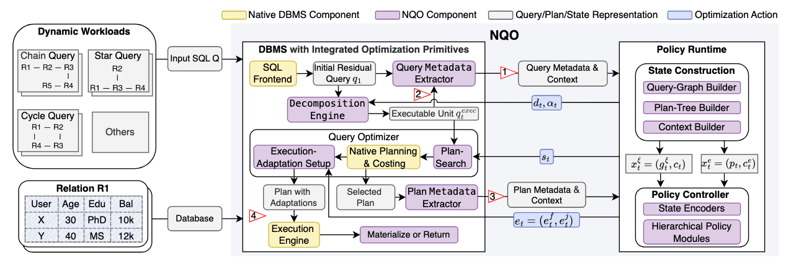

# NQO

NQO is a workload-agnostic learned query optimizer for PostgreSQL. A
hierarchical policy composes actions across pre-planning, planning, and
execution using shared query-graph and plan-tree representations.



## 1. Setup

```bash
conda env create -f environment.yml
conda activate nqo
pip install -e .
```

Apply the database patch and build the LIP extension as described in
[db_integration/README.md](db_integration/README.md). The standalone policy
service can then be started with:

```bash
nqo-server --host 127.0.0.1 --port 8088
```

The canonical SQL sets are `workloads/query_job` (113 queries),
`workloads/query_stack` (112), and `workloads/query_tpch` (22). Their
train/test protocols are defined in `workloads/train_test.py`.

### Database configuration

The experiment host has 48 CPU cores and 125 GiB of memory. Database
configuration files are:

- `config/postgresql.sql`: instance-wide experiment settings shared by all
  workloads.
- `config/setup_database.sql`: extensions required in each workload database.
- `config/prewarm_all.sql`: optional prewarming of public tables and indexes.

Apply the shared settings and database extensions with:

```bash
docker exec -i pgdb_dev_opt /code/pgdb-dev/psql/bin/psql \
  -h localhost -U pgdb -d imdb_ori < config/postgresql.sql
docker exec -u pgdb pgdb_dev_opt /code/pgdb-dev/psql/bin/pg_ctl \
  -D /code/pgdb-dev/psql/data restart

for db in imdb_ori imdb_scale_25 imdb_scale_50 imdb_scale_75 \
          so so_scale_50 tpch; do
  docker exec -i pgdb_dev_opt /code/pgdb-dev/psql/bin/psql \
    -h localhost -U pgdb -d "$db" < config/setup_database.sql
done
```

NQO action GUCs are set per session by the reproduction runners. Run
`prewarm_all.sql` only for warm-cache experiments; after loading or changing
data, refresh table statistics explicitly because autovacuum is disabled.

## 2. Using NQO

After installing the PostgreSQL patch, the LIP extension, and starting
`nqo-server`, enable NQO for a database session and submit ordinary SQL:

```bash
psql -h localhost -p 15432 -U pgdb -d imdb_ori <<'SQL'
SET nqo = on;
SET nqo.server_url = 'http://127.0.0.1:8088/action';
SELECT count(*)
FROM title AS t JOIN movie_info AS mi ON mi.movie_id = t.id
WHERE t.production_year >= 2000;
SQL
```

Applications use the same session-level settings. For example, with
`psycopg2`:

```python
import psycopg2

with psycopg2.connect(host="localhost", port=15432,
                      dbname="imdb_ori", user="pgdb") as conn:
    with conn.cursor() as cur:
        cur.execute("SET nqo = on")
        cur.execute("SET nqo.server_url = 'http://127.0.0.1:8088/action'")
        cur.execute("SELECT count(*) FROM title")
        print(cur.fetchone()[0])
```

The settings apply to all subsequent `SELECT` statements on that connection.
Use `SET nqo = off` to return to native PostgreSQL optimization.

### Using individual actions

`SET nqo = on` enables the NQO pipeline but does not force a particular
action. Action choices come from the policy server. The `nqo.search_*`,
`nqo.aja_*`, and `nqo.lip_*` GUC families configure plan-search parameters and
execution-action guardrails; they do not select actions. To isolate one action,
stop the current policy server and start the fixed policy on port `8088` with
one of these commands:

```bash
# Dec only: apply query decomposition once, then execute the residual query.
NQO_FIXED_DEC=apply NQO_FIXED_DEC_ROUNDS=1 \
  nqo-server --model-module runtime.policies.fixed:predict

# Enum only: retain five alternative join orders.
NQO_FIXED_ENUM=top5 \
  nqo-server --model-module runtime.policies.fixed:predict

# Filter only: selectively apply the Bloom-filter action.
NQO_FIXED_FILTER=selective \
  nqo-server --model-module runtime.policies.fixed:predict

# AJoin only: use the conservative adaptive-join action.
NQO_FIXED_AJOIN=conservative \
  nqo-server --model-module runtime.policies.fixed:predict
```

After starting any one of the servers above, execute the same ordinary SQL
through `psql`:

```bash
psql -h localhost -p 15432 -U pgdb -d imdb_ori <<'SQL'
SET nqo = on;
SET nqo.server_url = 'http://127.0.0.1:8088/action';
SELECT count(*)
FROM title AS t
JOIN movie_info AS mi ON mi.movie_id = t.id
JOIN movie_keyword AS mk ON mk.movie_id = t.id
WHERE t.production_year >= 2000;
SQL
```

The fixed server leaves all unspecified actions at their defaults. An enabled
action is applied only when its eligibility and safety checks succeed; for
example, LIP requires an eligible integer equi-join, and AJA requires a safely
matched adaptive-join candidate.

## 3. Released artifacts

### Execution buffers

`results/buffers/` contains seven lightweight SQLite buffers totaling about
169 MiB. They contain execution experience collected on our local
PostgreSQL installation and support deterministic replay and training
without rerunning a matching SQL/action trajectory. The main JOB, STACK, and
TPC-H buffers contain 11,045, 12,090, and 266 records, respectively. Their
one-table schema and every field are documented in
[results/buffers/README.md](results/buffers/README.md).

Released buffers are read-only inputs. New executions should use a separate
path under `../pgdb/.nqo_runtime/` so that released measurements remain
unchanged.

### Models

`results/models/` contains 176 versioned NQO checkpoints (about 348 MiB)
trained using the released execution experience. It includes workload-specific,
mixed-workload, and ablation checkpoints used by the paper experiments.

## 4. Reproducing NQO results

Released NQO measurements and analysis programs are under
`results/benchmark/nqo/`. Fresh runs must use a separate output path; runtime
logs and private writable buffers are placed under
`../pgdb/.nqo_runtime/reproduction/`. Unless stated otherwise, producer scripts
are under `scripts/reproduce/nqo/`, and released analysis scripts and logs are
under `results/benchmark/nqo/`.

Verify all released checkpoints and buffer references without executing SQL:

```bash
python scripts/reproduce/nqo/verify_artifacts.py
```

### Overall performance

**Purpose.** Evaluate NQO against PostgreSQL over every workload--split
combination, both end to end and per query.

**Run.** `run.py` is the core runner. The JOB and STACK wrappers evaluate all
three protocols and folds; TPC-H uses the random split.

```bash
OUT=results/benchmark/temp_nqo_reproduction
mkdir -p "$OUT/logs"

# Evaluate every JOB protocol and fold.
NQO_OUTPUT="$OUT/nqo_runs.csv" \
  bash scripts/reproduce/nqo/run_job_parallel.sh error \
  2>&1 | tee "$OUT/logs/job.log"
# Evaluate every STACK protocol and fold.
NQO_OUTPUT="$OUT/nqo_runs.csv" \
  bash scripts/reproduce/nqo/run_stack_parallel.sh error \
  2>&1 | tee "$OUT/logs/stack.log"

# Evaluate PostgreSQL and the three TPC-H random-split folds.
{
  python scripts/reproduce/nqo/run.py \
    --dataset tpch --method postgres --output "$OUT/nqo_runs.csv"
  for fold in a b c; do
    python scripts/reproduce/nqo/run.py \
      --dataset tpch --method nqo --protocol random --fold "$fold" \
      --output "$OUT/nqo_runs.csv"
  done
} 2>&1 | tee "$OUT/logs/tpch.log"
```

**Outputs and analysis.** The released measurements are in
`results/benchmark/nqo/nqo_runs.csv`. `analyze_nqo.py` prints overall,
per-query, and action-frequency summaries. Its released output is
`analyze_nqo.log`.

```bash
OUT=results/benchmark/temp_nqo_reproduction
mkdir -p "$OUT/logs"
python results/benchmark/nqo/analyze_nqo.py all \
  2>&1 | tee "$OUT/logs/analyze_nqo.log"
python results/benchmark/build_overall_performance_comparison.py
```

The unified NQO/baseline table is
`results/benchmark/overall_performance_comparison.csv`.

### Learning efficiency

**Purpose.** Measure how held-out workload performance changes with training
iterations, wall-clock training time, and accumulated execution feedback.

**Run.** Evaluate the retained checkpoint inventory. Fresh matrix training also
writes one `learning_curve.csv` per workload; after those runs finish, export
their cumulative active training times with the second command.

```bash
OUT=results/benchmark/temp_nqo_reproduction
mkdir -p "$OUT/logs"

# Evaluate all retained checkpoints.
python scripts/reproduce/nqo/run_learning_trace.py \
  --output "$OUT/nqo_learning_trace.csv" \
  2>&1 | tee "$OUT/logs/learning_trace.log"

# Export cumulative training time after fresh matrix training completes.
python scripts/reproduce/nqo/export_learning_time.py \
  --matrix JOB=/path/to/job/learning_curve.csv \
  --matrix STACK=/path/to/stack/learning_curve.csv \
  --matrix TPCH=/path/to/tpch/learning_curve.csv \
  --output "$OUT/nqo_learning_time.csv"
```

**Outputs and analysis.** Released checkpoint evaluations and measured training
times are `nqo_learning_trace.csv` and `nqo_learning_time.csv`. Analyze them
together with `analyze_nqo_learning.py`; the released printed output is
`analyze_nqo_learning.log`.

```bash
OUT=results/benchmark/temp_nqo_reproduction
mkdir -p "$OUT/logs"
python results/benchmark/nqo/analyze_nqo_learning.py \
  2>&1 | tee "$OUT/logs/analyze_nqo_learning.log"
```

### Transferability

**Purpose.** Evaluate whether NQO policies transfer across workloads without
retraining and remain effective when database scale changes.

**Run.** Run the mixed-workload and zero-shot evaluations, followed by the JOB
and STACK data-scale experiments.

```bash
OUT=results/benchmark/temp_nqo_reproduction
mkdir -p "$OUT/logs"

# Mixed-workload training and zero-shot cross-workload transfer.
python scripts/reproduce/nqo/run_transfer.py \
  --experiment all --output "$OUT/nqo_transfer_run.csv" \
  2>&1 | tee "$OUT/logs/transfer.log"
# JOB policies evaluated on three reduced database scales.
NQO_OUTPUT_ROOT="$OUT" \
  bash scripts/reproduce/nqo/run_data_scale.sh 25 50 75 \
  2>&1 | tee "$OUT/logs/job_data_scale.log"
# STACK policies evaluated on the 50% database scale.
NQO_OUTPUT_ROOT="$OUT" \
  bash scripts/reproduce/nqo/run_stack_data_scale.sh \
  2>&1 | tee "$OUT/logs/stack_data_scale.log"
```

**Outputs and analysis.** Released cross-workload results are in
`nqo_transfer_run.csv`; scale results are in
`nqo_job_scale_{25,50,75}_runs.csv` and `nqo_stack_scale_50_runs.csv`. Analyze
them with `analyze_nqo_transfer.py` and `analyze_nqo_data_scale.py`. Their
released printed outputs are the adjacent `.log` files.

```bash
OUT=results/benchmark/temp_nqo_reproduction
mkdir -p "$OUT/logs"
python results/benchmark/nqo/analyze_nqo_transfer.py \
  2>&1 | tee "$OUT/logs/analyze_nqo_transfer.log"
python results/benchmark/nqo/analyze_nqo_data_scale.py \
  2>&1 | tee "$OUT/logs/analyze_nqo_data_scale.log"
```

### Component analysis

**Purpose.** Quantify action frequency and importance, compare RL and state
representations, and study decomposition depth and scheduling sensitivity.

**Run.** Replay the retained ablation checkpoints and execute the two
sensitivity experiments. `run_decomposition_depth.py` currently writes its
fixed released output path directly; the other commands below use a temporary
output directory.

```bash
OUT=results/benchmark/temp_nqo_reproduction
mkdir -p "$OUT/logs"

# Action importance: evaluate checkpoints retrained with one action disabled.
python scripts/reproduce/nqo/run_abl_action.py \
  --output "$OUT/nqo_abl_action_run.csv" \
  2>&1 | tee "$OUT/logs/abl_action.log"
# RL formulation: evaluate hierarchical SMDP and one-step RL checkpoints.
python scripts/reproduce/nqo/run_abl_rl.py \
  --output "$OUT/nqo_abl_rl_run.csv" \
  2>&1 | tee "$OUT/logs/abl_rl.log"
# State representation: evaluate checkpoints trained without query or plan topology.
python scripts/reproduce/nqo/run_abl_state.py \
  --output "$OUT/nqo_abl_sate_run.csv" \
  2>&1 | tee "$OUT/logs/abl_state.log"
# Decomposition depth: force a fixed number of split rounds.
python scripts/reproduce/nqo/run_decomposition_depth.py \
  2>&1 | tee "$OUT/logs/decomposition_depth.log"
# Scheduling sensitivity: override learned scheduling with fixed alpha values.
python scripts/reproduce/nqo/run_alpha_sensitivity.py \
  --output "$OUT/nqo_alpha_sensitivity.csv" \
  2>&1 | tee "$OUT/logs/alpha_sensitivity.log"
```

**Outputs and analysis.** Action frequency comes from `nqo_runs.csv`. The
released component results are `nqo_abl_action_run.csv`, `nqo_abl_rl_run.csv`,
`nqo_abl_sate_run.csv` (original spelling), `nqo_decomposition_depth.csv`, and
`nqo_alpha_sensitivity.csv`. Print the corresponding analyses with:

```bash
OUT=results/benchmark/temp_nqo_reproduction
mkdir -p "$OUT/logs"
# Action frequencies from the main NQO evaluation.
python results/benchmark/nqo/analyze_nqo.py all \
  2>&1 | tee "$OUT/logs/action_frequency.log"
# Action, RL-formulation, and state-representation ablations.
python results/benchmark/nqo/analyze_nqo_abl.py \
  2>&1 | tee "$OUT/logs/analyze_nqo_abl.log"
# Fixed decomposition-depth experiment.
python results/benchmark/nqo/analyze_nqo_decomposition_depth.py \
  2>&1 | tee "$OUT/logs/analyze_nqo_decomposition_depth.log"
# Fixed versus learned scheduling alpha.
python results/benchmark/nqo/analyze_nqo_alpha_sensitivity.py \
  2>&1 | tee "$OUT/logs/analyze_nqo_alpha_sensitivity.log"
```

### Overhead analysis

**Purpose.** Measure NQO training and inference costs, plus the runtime and
materialization overhead of its individual optimization actions.

**Run.** Execute each standalone action against PostgreSQL and export the
compact measurements.

```bash
OUT=results/benchmark/temp_nqo_reproduction
mkdir -p "$OUT/logs"

# Execute Dec, Enum, Filter, and AJoin independently.
python scripts/reproduce/nqo/run_independent_actions.py \
  --output "$OUT/nqo_independent_action_runs.csv" \
  2>&1 | tee "$OUT/logs/independent_actions.log"
```

**Outputs and analysis.** Released action measurements are in
`nqo_independent_action_runs.csv`; inference measurements come from
`nqo_runs.csv`; and training-time measurements are in `nqo_learning_time.csv`.
`nqo_training_time_comparison.csv` assembles cross-system training times from
the method-specific measurements and estimates recorded in its evidence column.
Print the released overhead tables with
`analyze_nqo_overhead.py`; its captured output is `analyze_nqo_overhead.log`.

```bash
OUT=results/benchmark/temp_nqo_reproduction
mkdir -p "$OUT/logs"
python results/benchmark/nqo/analyze_nqo_overhead.py \
  2>&1 | tee "$OUT/logs/analyze_nqo_overhead.log"
```

## 5. Reproducing learned baselines

The official source repositories are listed in
[thrid_party/README.md](thrid_party/README.md). All commands below execute the
systems locally and write fresh artifacts to
`results/benchmark/temp_baseline_reproduction/`. Redirecting stdout and stderr
with `tee` provides a complete run log alongside those artifacts.

First collect one PostgreSQL execution per query:

```bash
OUT=results/benchmark/temp_baseline_reproduction
mkdir -p "$OUT/logs"
python -m scripts.reproduce.postgresql.measure_baseline_postgres \
  --workload all --output-root "$OUT" 2>&1 | tee "$OUT/logs/postgresql.log"
```


### FASTgres

We use the official FASTgres release in `thrid_party/FASTgres-PVLDBv16`. Our
adapters enumerate the 64 hint configurations for JOB, STACK, and TPC-H,
construct the upstream features, train each paper split, predict a hint, and
execute it once:

```bash
python -m scripts.reproduce.fastgres.measure_fastgres_labels \
  --workload all --output-root "$OUT" 2>&1 | tee "$OUT/logs/fastgres-labels.log"
python -m scripts.reproduce.fastgres.run_fastgres_full \
  --workload all --output-root "$OUT" 2>&1 | tee "$OUT/logs/fastgres.log"
```

Fresh labels, model predictions, executions, and timing JSON files are written
under `$OUT/{job,stack,tpch}/fastgres/`. The released compact results are in
`results/benchmark/fastgres/`. Each workload directory contains:

- `hint_configuration_executions.csv`: measured runtimes for the 64 candidate
  hint configurations, which provide the labels used to train FASTgres.
- `predicted_hints.json`: predicted hints for every protocol and fold, together
  with the corresponding training, prediction, and fold-audit metadata.
- `predicted_hint_executions.csv`: one final execution of each predicted hint,
  including the PostgreSQL runtime, timeout status, and inference time.

### TONIC

We use the official TONIC release in `thrid_party/TONIC`. JOB uses the
authors' released feedback after locally extracting query skeletons; STACK and
TPC-H collect feedback in our database. Training is isolated by split, and
each predicted join assignment is executed once:

```bash
python -m scripts.reproduce.tonic.measure_tonic_feedback \
  --workload JOB --skeletons-only --output-root "$OUT"
python -m scripts.reproduce.tonic.measure_tonic_feedback \
  --workload STACK --output-root "$OUT"
python -m scripts.reproduce.tonic.measure_tonic_feedback \
  --workload TPCH --output-root "$OUT"
python -m scripts.reproduce.tonic.run_tonic_full \
  --workload JOB --feedback-source original_job --output-root "$OUT"
python -m scripts.reproduce.tonic.run_tonic_full \
  --workload STACK --output-root "$OUT"
python -m scripts.reproduce.tonic.run_tonic_full \
  --workload TPCH --output-root "$OUT"
```

Fresh skeletons, feedback, predictions, executions, and timing JSON files are
under `$OUT/{job,stack,tpch}/tonic*/`. The released compact results are in
`results/benchmark/tonic/`. The workload directories contain:

- `query_skeletons.json`: the extracted join skeleton and controllable join
  steps for each query.
- `released_feedback/*.sql` (JOB): released join-assignment feedback represented
  as candidate hints and their measured runtimes.
- `join_assignment_feedback_executions.csv` (STACK and TPC-H): locally measured
  runtimes for candidate join assignments used as training feedback.
- `predicted_join_assignments.json`: predicted assignments for every protocol
  and fold, together with training, prediction, and fold-audit metadata.
- `predicted_join_assignment_executions.csv`: one final execution of each
  predicted assignment, including the generated hint, PostgreSQL runtime,
  timeout status, and inference time.

### GenJoin, HybridQO, and AutoSteer

These adapters follow the source and benchmark process in
`thrid_party/genjoin` while retaining one final execution of PostgreSQL and one
final execution of the selected system plan for comparison. For example, the
TPC-H experiments are run directly as follows:

```bash
python -m scripts.reproduce.genjoin.run_genjoin_tpch all \
  --models 1 --output-root "$OUT"
for fold in random_a random_b random_c; do
  python -m scripts.reproduce.hybridqo.run_hybridqo_tpch \
    --fold "$fold" --output-root "$OUT"
done
python -m scripts.reproduce.autosteer.run_autosteer_tpch \
  --phase all --output-root "$OUT"
```

These commands collect, train, predict, and execute locally. Released results
are in `results/benchmark/genjoin_baselines/`.
