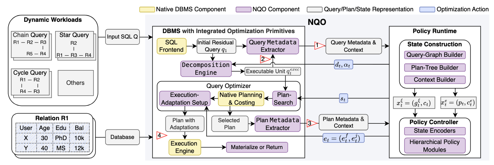

# NeurQO

NeurQO is a workload-agnostic learned query optimizer for PostgreSQL.



## Benchmark with the Prebuilt Docker Image

The simplest way to benchmark NeurQO is to use our self-contained CPU Docker image.

It includes PostgreSQL 16.3 source code, the compiled database engine with NeurQO optimization primitives, the policy runtime, 21 trained models, benchmark SQL, and preloaded JOB, STACK, and TPC-H databases. JOB's 25%/50%/75% and STACK's 50% database variants are included as well.

**Download:** [neurqo-release.tar.gz on Google Drive](https://drive.google.com/file/d/1-X34TUr7indOnRe4mNPuam0PlhUAYzX4/view?usp=sharing), approximately 56.1 GiB.

### 1. Download and Start

First download source code with client-side bencmmark scripts.

```bash
conda create -n neurqo-client python=3.11 -y
conda activate neurqo-client

git clone https://github.com/NLGithubWP/neurqo.git
cd neurqo
```

Then, download the Docker image archive from the Google Drive link above to `~/Downloads/neurqo-release.tar.gz`, load it, and start the container. Allow around 96 GiB of container memory and 300 GiB of free Docker storage, plus space for the downloaded archive. (Estimated download and setup time: 1-3 hours, depending on network and disk speed.)

```bash
docker load -i ~/Downloads/neurqo-release.tar.gz
docker run -d --name neurqo --cpus 4 --memory 96g --stop-timeout 60 neurqo:release
docker logs -f neurqo
```

Wait for `Ready`, then leave the log viewer with Ctrl-C. PostgreSQL and the three dataset-specific inference servers start automatically; training and benchmarks do not. No host directory mounts or published ports are needed.

### 2. Run the Main Benchmark

Run the client-side benchmark scripts in the `neurqo-client` environment:

```bash
# JOB and STACK: all three protocols, each with folds a/b/c.
python3 scripts/reproduce/docker_benchmark.py --dataset job --protocol all --fold all
python3 scripts/reproduce/docker_benchmark.py --dataset stack --protocol all --fold all

# TPC-H: the three Random test folds (7/7/8); QuerySplit is disabled.
python3 scripts/reproduce/docker_benchmark.py --dataset tpch --protocol random --fold all
```

For each dataset command, execution is serial and proceeds in this order:

1. **PostgreSQL:** collect the distinct SQLs from the selected test folds, disable NeurQO, and run each SQL three consecutive times. Use its **first** runtime as the baseline shared by all selected protocols/folds within this command.
2. **NeurQO:** after the entire PG phase finishes, load the pretrained checkpoint for each protocol/fold, enable NeurQO, and run every SQL in that fold's test set **once**. The same SQL appearing in different folds is evaluated with each fold's corresponding model.
3. **Aggregate:** for each protocol, sum the PG times over test folds a/b/c, sum the corresponding NeurQO times, then compute `WS = sum(PG runtimes) / sum(NeurQO runtimes)`. The output also reports GS, improved-query percentage and timeout counts.

Every execution has a fresh connection, with no reused temporary tables. Timing includes execution, result consumption and result hashing. Each run saves JSON/CSV results to a new local folder, `results/benchmark_neurqo_<timestamp>/`; use `--output PATH` to specify a different destination.

## Benchmark New Workloads

To benchmark NeurQO on new datasets and workloads, complete the following steps.

1. Create a database in the running container, load your schema and data into `public`, define indexes and primary/foreign keys, and run `ANALYZE`. For example, using your own SQL dump:
  ```bash
   docker exec neurqo createdb -U neurdb my_dataset
   docker exec -i neurqo psql -U neurdb -d my_dataset -v ON_ERROR_STOP=1 < /path/to/dataset.sql
   docker exec neurqo psql -U neurdb -d my_dataset -c 'ANALYZE;'
  ```
2. Add SQL files under `workloads/query_<dataset>/`, then add train/test IDs to the `SPLITS` dictionary in `workloads/train_test.py`. For a three-query example:
  ```bash
   mkdir -p workloads/query_my_dataset
   cp /path/to/queries/*.sql workloads/query_my_dataset/
  ```
3. Register the database, protocols, and SQL directory in `src/benchmarking/workloads.py`, after the corresponding dictionary definitions:
  ```python
   WORKLOAD_DATABASES["MY_DATASET"] = "my_dataset"
   SPLIT_PROTOCOLS["MY_DATASET"] = ("random",)
   QUERY_DIRECTORIES["MY_DATASET"] = "query_my_dataset"
  ```

Run from the cloned repository in the `neurqo-client` environment:

```bash
python3 scripts/reproduce/docker_train.py --dataset my_dataset --protocol all --fold all --output results/training/my_dataset
```

The script first runs each query with PG and records its runtime and result hash. It then tests QuerySplit (`alpha=0.5`, where supported), Top-5 Search, selective LIP, conservative AJA, and a no-action reference. By default, NeurQO uses each fold's training-query experience for 16 epochs of pretraining, then runs 32 online training iterations and evaluates the model on that fold's test queries at iterations 0/4/8/.../32. When a matching execution is already in the dataset buffer, the script reuses its recorded runtime instead of running it again.

You can adjust the training schedule with `--pretrain-epochs`, `--iterations`, and `--eval-every`, and set dataset-specific action parameters with `--action-config PATH`.

Outputs:

- **PG reference and action measurements:** `results/training/my_dataset/reports/my_dataset/postgres/` and `actions/`, including `baseline.json`, per-query `episodes.csv`, and summaries.
- **Experience:** `/opt/neurqo/runtime/training/experience/my_dataset.sqlite` in the container, shared across protocols and folds.
- **Models:** `results/training/my_dataset/models/<protocol>/<fold>/best.pt`, selected by each fold's highest checkpoint test WS. Evaluation histories are under `reports/my_dataset/<protocol>-<fold>/learning_curve.jsonl`; resumable checkpoints remain in the container workspace printed by the script.

Test the trained models through the same benchmark client. This mode reuses the collected PG reference and matching buffer labels, executing only missing NeurQO trajectories:

```bash
python3 scripts/reproduce/docker_benchmark.py --dataset my_dataset --protocol all --fold all --training-run results/training/my_dataset
```

For each protocol, WS is the sum of PG test times across folds divided by the sum of NeurQO test times, not the mean of fold WS values. To continue training, use `docker_train.py --dataset my_dataset --resume results/training/my_dataset --iterations 48`.

## Reproduce the Paper Experiments

See [the reproduction guide](docs/reproduce.md) for instructions on reproducing the experiments in our paper.
